<p align="center"><a href="README.md">English</a> · <strong>简体中文</strong></p>

<p align="center"></p>

# TIKAZ Context Economy for Codex

**面向文本、文件、对话、表格与视觉证据的高保真上下文准备工作流。**

由 **TIKAZ** 主导设计、整合、独立重构和持续维护。

Context Economy 不是“全部压缩”的技巧。它准备的是**仍然可以核验的最小有用上下文**：支持的文档转成可复用 Markdown，事实与来源锚点得到保护，图片和复杂表格进入 Text / Hybrid / Source 路由，转换不确定时保留原始来源。


<p align="center"></p>

## 🧩 可以单独使用的 Skill

| Skill | 单独使用场景 | 主要输出 |
|---|---|---|
| [`context-economy`](https://tikazi.github.io/TIKAZ-AI-Skills/zh/skills/context-economy/index.html) | 输入混合或需要自动选择处理路线 | 路由结果、上下文、遗漏项与验证边界 |
| [`context-pack`](https://tikazi.github.io/TIKAZ-AI-Skills/zh/skills/context-pack/index.html) | 文件、代码或日志需要形成一次任务移交 | Context Markdown、锚点、视觉队列和成本台账 |
| [`conversation-checkpoint`](https://tikazi.github.io/TIKAZ-AI-Skills/zh/skills/conversation-checkpoint/index.html) | 长对话需要压缩、恢复或移交 | 七部分的可恢复任务状态 |
| [`context-audit`](https://tikazi.github.io/TIKAZ-AI-Skills/zh/skills/context-audit/index.html) | 只诊断现有上下文而不改写 | 六维 Context Health 报告 |
| [`context-benchmark`](https://tikazi.github.io/TIKAZ-AI-Skills/zh/skills/context-benchmark/index.html) | 节省与保真主张需要可复现实证 | 原始用例、指标、汇总和证据卡 |

安装套件可获得完整编排；复制任一子文件夹即可单独安装专业 Skill。

## 🔄 自动路由

- 纯文本、代码、日志和结构化数据走 **Text**。
- 有任务相关图片或复杂表格的文档走 **Hybrid**，Markdown 仍是主要上下文，只把必要视觉证据加入有上限的队列。
- 扫描件、重布局文件、转换器缺失或提取不确定时走 **Source**，保留原文件或原页面。
- 长对话转为 **Checkpoint**，保留决策、约束、完成证据、路径、数字、命令和开放问题。

## 网页转为可追溯 Markdown

网页流程可选使用固定版本的 Defuddle 适配器，Python 核心仍保持零强制外部依赖。它同时保留原始 HTML、清理后 HTML、Markdown、元数据、独立的字节/Token 估算，以及 Text / Hybrid / Source 分流结果。

```powershell
Set-Location .\adapters\defuddle
npm ci
Set-Location ..\..
python .\scripts\tikaz_context.py web `
  --url 'https://example.com/article' `
  --task '提取发布证据' `
  --output .\.context-economy-web
```

安装必须由用户明确执行，只影响网页适配器。流程不会执行网页脚本，也关闭了 Defuddle 的第三方异步提取回退；公开 URL、重定向、超时和响应体积均有限制。正文含信息图或复杂表格时进入 Hybrid；动态空壳、依赖缺失或提取不足时保留 `source.html` 并进入 Source。

## 🚀 快速使用

```powershell
python .\scripts\tikaz_context.py pack `
  --input .\notes.md `
  --query 'prepare the release validation context' `
  --budget 800 `
  --visual-budget 4 `
  --output .\.context-economy
```

只安装一个 Skill：

```powershell
Copy-Item -Recurse `
  -LiteralPath '.\suites\context-economy\context-pack' `
  -Destination '.\.agents\skills\context-pack'
```

## ⚠️ 真实限制

- 文档转换依赖当前环境中可用的适配器，不会静默安装依赖。
- 估算 Token 不等于 Provider 账单遥测。
- 图片在视觉宿主实际检查前保持 `pending-vision`。
- 生成 PDF 的字面保真测试不证明 OCR、复杂布局、图表语义或扫描件泛化。
- 短小、密集或高风险输入可能增长或直接透传。
- 不确定转换回退到原始来源，不伪装成压缩成功。

## 📊 可复现证据

当前公开基准包含 50 个合成样例和独立生成 PDF 固定样例。六个长上下文任务的估算 Token 降低 **69.7%**，受保护事实 **46/46**，预期锚点 **39/39**；30 个短输入样例增长 **143.9%**，作为协议开销的公开负面证据保留。

这些数字只描述声明的固定样例，不是普遍节省承诺。真实 Provider Token、扫描 PDF、视觉语义准确率和下游盲测仍为 **Pending**。

来源、许可证与具体 TIKAZ 贡献见仓库根目录的 [SOURCES.yml](SOURCES.yml) 和 [THIRD_PARTY_NOTICES.md](THIRD_PARTY_NOTICES.md)。

## 🌐 探索 TIKAZ 工作流家族

[🏠 AI Skills](https://github.com/TIKAZI/TIKAZ-AI-Skills) · [⚡ Context Economy](https://github.com/TIKAZI/TIKAZ-Codex-Context-Economy) · [🎨 Frontend Design](https://github.com/TIKAZI/TIKAZ-Codex-Frontend-Design) · [🎬 Video Intelligence](https://github.com/TIKAZI/TIKAZ-Codex-Video-Intelligence) · [🛠️ Engineering](https://github.com/TIKAZI/TIKAZ-Codex-Engineering) · [🔬 Research](https://github.com/TIKAZI/TIKAZ-Codex-Knowledge-Research) · [📽️ Presentation](https://github.com/TIKAZI/TIKAZ-Codex-Presentation) · [🖼️ Visual Content](https://github.com/TIKAZI/TIKAZ-Codex-Visual-Content)
